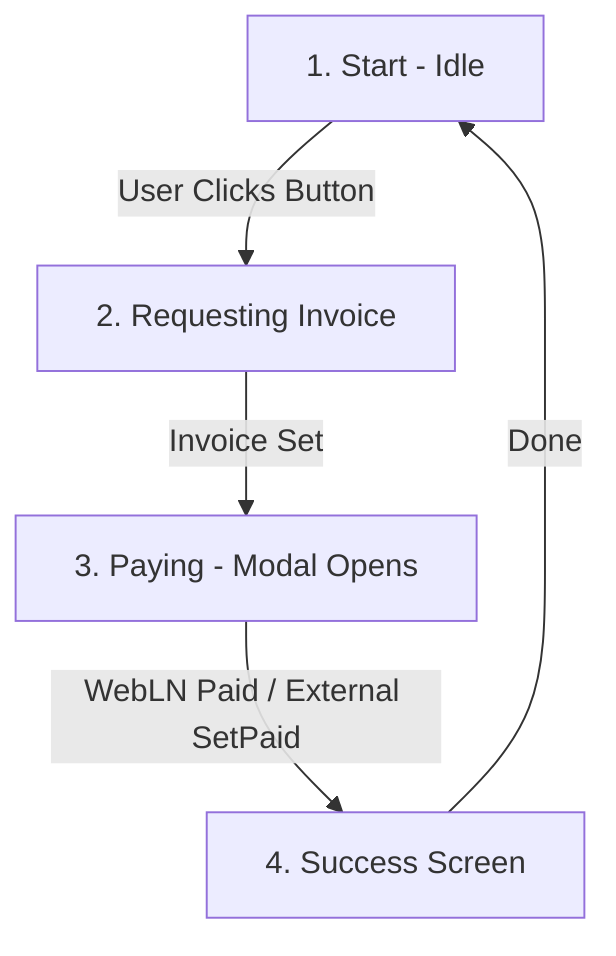

# Bitcoin Connect

## How to install

Two packages are available depending on your framework:

**Web Components (React, Vue, Angular, Solid.js, pure HTML):**

Install the npm package `@getalby/bitcoin-connect@^3.0.0`

**React-specific components:**

Install the npm package `@getalby/bitcoin-connect-react@^3.0.0`

**WebLN Types:**

Install `@webbtc/webln-types` as a dev dependency and create a `webln-types.d.ts` with the following content:

```ts
/// <reference types="@webbtc/webln-types" />
```

**CDN (HTML-only, no build step):**

```html
<script src="https://esm.sh/@getalby/bitcoin-connect@^3.0.0"></script>
```

or

```html
<script type="module">
  import {launchModal} from 'https://esm.sh/@getalby/bitcoin-connect@^3.0.0';
  //...use it here
</script>
```

## Key concepts

- Web components for connecting Lightning wallets and enabling WebLN
- Works with React, Vue, Angular, Solid.js, and pure HTML
- Desktop and mobile support (no browser extension required)
- Payment UI for accepting payments via QR code or connected wallet
- Supports multiple wallet connectors: Alby Hub, NWC, LNbits, Lightning Node Connect, and more

## Payment Flow Lifecycle

Understanding the transition between the button states and the payment modal is key to building a great user experience. The process follows a 4-stage flow:



### 1. Start (Idle)
- The user sees a `<bc-pay-button>` or a custom button.
- The component is in an idle state, waiting for user interaction.

### 2. Requesting Invoice
- Triggered by the `click` event.
- The application fetches a BOLT-11 invoice (e.g., from your backend or using `@getalby/lightning-tools`).
- **Web Component**: Set the `invoice` attribute on `<bc-pay-button>`.
- **React**: Update the `invoice` prop on `PayButton`.

### 3. Paying
- The **Payment Modal** launches automatically (via `PayButton`) or programmatically (via `launchPaymentModal`).
- The user chooses a payment method:
  - **Extension**: Uses an installed WebLN provider (like Alby).
  - **NWC**: Uses Nostr Wallet Connect.
  - **Scanner**: Shows a QR code for external wallets.
- If using WebLN, the payment is executed as `provider.sendPayment(invoice)`.

### 4. Showing Success Screen
- **Automatic**: For WebLN payments, the modal transitions to the success screen automatically.
- **Manual**: For QR code payments, the app must poll for payment status and then call `setPaid()` to show the success screen in the modal.
- **Completion**: The `onPaid` (React) or `bc:onpaid` (Web Components) event fires, providing the `preimage`.

## Units

Unlike NWC, WebLN operates on sats, not millisats. (1000 millisats = 1 satoshi)

## Initialization

```ts
import { init } from "@getalby/bitcoin-connect";

init({
  appName: "My App",
  // optional:
  // appIcon: "https://example.com/icon.png",
  // showBalance: true,
  // filters: ["nwc"], // only allow NWC wallets
});
```

## Core API

### Launch wallet connection modal

```ts
import { launchModal } from "@getalby/bitcoin-connect";

launchModal();
```

### Launch payment modal

```ts
import { launchPaymentModal } from "@getalby/bitcoin-connect";

const { setPaid } = launchPaymentModal({
  invoice: "lnbc...", // BOLT-11 invoice
  onPaid: (response) => {
    console.log("Payment preimage:", response.preimage);
  },
  onCancelled: () => {
    console.log("Payment cancelled");
  },
});

// For external payments (e.g. QR code scanned by another wallet):
// setPaid({ preimage: "..." });
```

### Request WebLN provider

```ts
import { requestProvider } from "@getalby/bitcoin-connect";

// Returns existing provider or launches modal for user to connect
const provider = await requestProvider();

// Now use WebLN methods
const { preimage } = await provider.sendPayment("lnbc...");
const { paymentRequest } = await provider.makeInvoice({ amount: 1000 });
const balance = await provider.getBalance?.();

```

#### Check the provider kind to get access to the underlying provider

```ts
import { WebLNProviders, requestProvider } from "@getalby/bitcoin-connect";

const provider = await requestProvider();

if (provider instanceof WebLNProviders.NostrWebLNProvider) {
  provider.client.nostrWalletConnectUrl; // access the connection secret
}
```

### Programmatic connection

```ts
import { connectNWC, disconnect } from "@getalby/bitcoin-connect";

// Connect directly with NWC URL
connectNWC("nostr+walletconnect://...");

// Disconnect and clear saved configuration
disconnect();
```

### Refresh the balance

If you make a payment, the bc-balance component by default will not refresh
which will lead to the balance being incorrect. In this case a refresh should be triggered:

```ts
import { refreshBalance } from "@getalby/bitcoin-connect";

refreshBalance();
```

## React components

```tsx
import { Button, PayButton, Connect, Payment } from "@getalby/bitcoin-connect-react";
import { init } from "@getalby/bitcoin-connect-react";

// Initialize once at app startup
init({ appName: "My App" });

// Connection button - launches modal when clicked
<Button />

// Pay button - launches payment modal when clicked
// NOTE: invoice can optionally be generated after the button is clicked by
// using the `onClick` event and updating the invoice argument in React
// or by using setAttribute('invoice') on the bc-pay-button element.
// the `payment` property can also be set in case the payment was made with an external wallet.
<PayButton
  invoice="lnbc..."
  onPaid={(response) => console.log("Paid!", response.preimage)}
/>

// Inline connect flow (no modal)
<Connect
  onConnected={(provider) => console.log("Connected!", provider)}
/>

// Inline payment flow (no modal)
<Payment
  invoice="lnbc..."
  onPaid={(response) => console.log("Paid!", response.preimage)}
/>
```

## Web components

```html
<!-- Initialize Bitcoin Connect -->
<script type="module">
  import {init} from 'https://esm.sh/@getalby/bitcoin-connect@3';
  init({ appName: "My App" });
</script>

<!-- Connection button -->
<bc-button></bc-button>

<!-- Pay button -->
<bc-pay-button invoice="lnbc..."></bc-pay-button>

<!-- Inline connect flow -->
<bc-connect></bc-connect>

<!-- Inline payment flow -->
<bc-payment invoice="lnbc..."></bc-payment>
```

## Events

```ts
import {
  onConnected,
  onDisconnected,
  onConnecting,
  onModalOpened,
  onModalClosed,
} from "@getalby/bitcoin-connect";

// Subscribe to wallet connection
const unsubscribe = onConnected((provider) => {
  console.log("Wallet connected!", provider);
});

// Subscribe to disconnection
onDisconnected(() => {
  console.log("Wallet disconnected");
});

// Subscribe to modal events
onModalOpened(() => console.log("Modal opened"));
onModalClosed(() => console.log("Modal closed"));

// Unsubscribe when done
unsubscribe();
```

## External Wallets

Bitcoin Connect payment modal / payment button supports both connecting a wallet, and paying with an external wallet. For external wallet payments, checking if the payment was made externally MUST be handled by the application (for example, using LNURL-verify if a payment was made to a lightning address, or if the app backend has an endpoint to check the status of the payment, use that).

## Referenced files

- [Bitcoin Connect typings](./bundle.d.ts)
- [Bitcoin Connect React typings](./react.bundle.d.ts)
